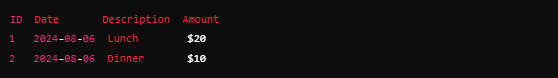

# Expense Tracker 

 Expense Tracker is a simple command line application for managing your personal finances. It allows you to add, delete and view your expenses, as well as providing detailed summaries. This app is a practical way to track and manage your finances efficiently.

## Features
- <strong>Add Expense:</strong> Register a new expense with description and value.

 - <strong>Delete Expense:</strong> Remove a recorded expense

 - <strong>View Expenses:</strong> See all recorded expenses.

 - <strong>Expense Summary:</strong> Removal Displays the total expenses recorded.

 - <strong>Monthly Summary:</strong> Removal Displays the total expenses recorded.

## Getting Started

<code> npm i @pedrocxz_/expense-tracker </code>

 To add an expense with a description and value, use the following command:

<code> $ expense-tracker add --description "Lunch" --amount 20
</code>

Expected answer:

<code>Expense added successfully</code>

To list all recorded expenses:

<code>$ expense-tracker list
</code>

Expected answer:

To see a summary of all expenses:

<code>$ expense-tracker summary </code>

Expected answer:

<code> Total expenses: $30
 </code>

To delete an expense, use the following command with the expense ID:

<code>$ expense-tracker delete --id 2
</code>

Expected answer:

<code>
Expense deleted successfully
</code>

To see a summary of expenses for a specific month (of the current year):

<code>$ expense-tracker summary --month 8
</code>

Expected answer:

<code>Total expenses for August: $20
</code>

<a href="https://roadmap.sh/projects/expense-tracker" target="_blank" >Roadmap.sh</a>

